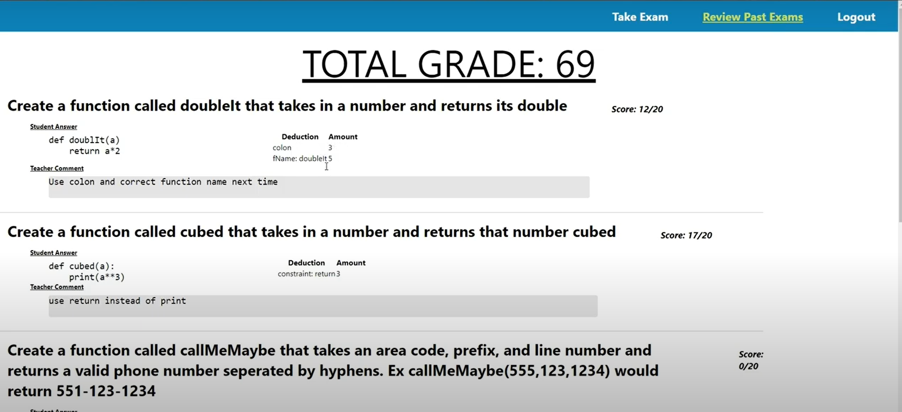
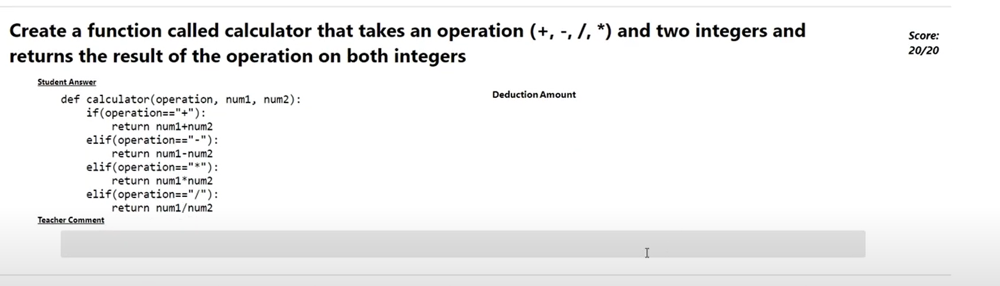

# Autograder
During the senior year, students had to work in groups of three members to cover a
front-end, middle-end, and back-end of a program where a Python exam
is taken online. 
 
This script belongs to the mid-end is written in php and serves as an auto-grader for a taken exam.

When a button is hit by a professor to review the exams (achieved in the front-end) the script checks for the action 
"autograde" and it requests all saved tests taken by students in the database and it will request to the database the 
test cases for each question, the constrain the professor set up as a must in the developing of a function (for loop, 
while loop, return or print statements, etc) the name of the function the professor asked for, and the maximum possible
points obtained if the student's answer is correct.

The php script writes a python script using the code the student wrote as their answer in the exam. The script also makes 
sure that even if there exist some errors in the student's answer, the code will run some test cases in order to 
avoid deducting too many points in each question. After the code is written in the python script, the php script
executes the python script, and saves the output in a text file to later compare such output with the correct output 
saved in the DB. If the output of the file, and the correct output saved in the database match, then points will not be 
deducted.

Additionally, the script is set up to check if a student used "def" and the first ":" (colon) when writing the required
functions.

After the exams has been all graded, all deductions, specifying where the student made the 
mistakes (test cases, function name, the first colon (":") and the constraint), and final grade are sent to the back-end,
that then are saved in the database.

# Points deducted
### Case when points are deducted
The image shows the deduction of points in each question when answer is not correct. Points deducted are displayed 
in detail.

 

### Case when points are not deducted
The image shows when the student answered correctly, no points are deducted

# Video 
This video demonstrates the functionality of the whole project

[Walk through video](https://youtu.be/y10WYicZYo8)